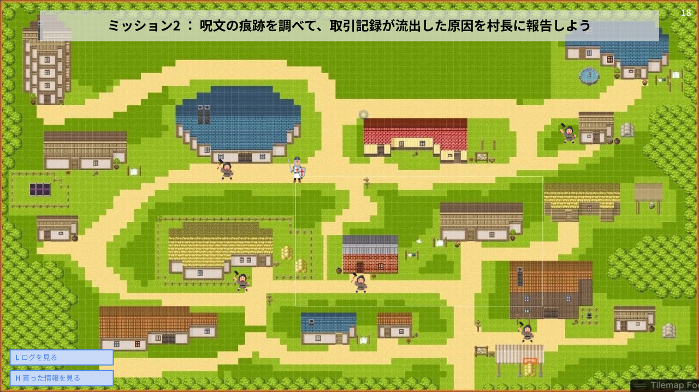

## 画面遷移・ゲームフロー

ゲームは以下の順で進行
1. タイトル・ログイン・シナリオ選択
2. 世界観の説明
3. 事件の説明
4. 村人に話を聞く
5. ログ解析・問題への回答
6. 村人に話を聞く2・問題への回答 (Optional)
7. エンディング
8. 現実のシナリオの解説

画面遷移・ゲームフローの詳細は [GameFlow.png](GameFlow.png) を参照

## 各場面の詳細

画面の番号は [GameFlow.png](GameFlow.png) 内の番号と一致している

### (1) タイトル画面
- タイトルをクリックするとログイン画面に遷移

### (2) ログイン画面
- ユーザ名とパスワードの入力欄、ログインボタンを用意
- ユーザ未登録であれば、登録画面へ遷移するためのボタンを押す
- ログインしたら、シナリオ選択画面へ遷移

画面のイメージ

### (3) 登録画面
- 基本的なつくりはログイン画面と同じ
- 登録したら自動でログインし、シナリオ選択画面へ遷移

### (4) シナリオ選択画面
- `シナリオ[通し番号]`と`簡単なシナリオ説明`を入れたボタンにする
- ボタンの背景はシナリオで使用するマップの画像とする

画面イメージ

### (5) 世界観の説明画面
- 背景はマップ全体を映す
- 説明は下部のダイアログに表示
- ダイアログは`Enter`キーで次へ進める

画面イメージ

### (6) 事件の説明画面
- 背景はマップ全体を映す
- 説明は下部のダイアログに表示
- 画面中央に説明と関連した画像を出す (例：交易記録→巻物の画像、呪文→魔法使いの画像)
- ダイアログは`Enter`キーで次へ進める

画面イメージ

### (7) プレイヤー操作画面1
- プレイヤーはマップ内を自由に移動可能
- やるべきことは画面上部に表示
- メニューボタンを押すと、メニュー画面を開ける
- マップ上に配置されている村人 (3人) に話しかけて事件のヒントを貰う
- 村人全員に話しかけたら自動的に、聞いた情報の一覧表示画面へ遷移

画面イメージ

### (8) メニュー画面
- 操作は「シナリオ選択に戻る」「ゲームに戻る」の2つだけ

画面イメージ

### (9) 聞いた情報の一覧表示画面
- 画面中央に大きめのダイアログを出す
- 村人の名前と村人が話した内容をそのまま表示

画面イメージ

### (10) プレイヤー操作画面2
- 基本的には プレイヤー操作画面1 と同じ
- 自由に移動できるようにする前に、ログを見て報告を促すダイアログを出す
- 「ログを見る」ボタンを追加、押すとログ表示画面に遷移
- 「情報を見るボタンを追加」、押すと聞いた情報の一覧表示画面に遷移
- 村長を追加し、村長に話しかけて事件の報告をできるようにする

画面イメージ

### (11) ログ表示画面
- 検索できるようにする (`grep --color`のように含む列だけ抽出、検索文字列をハイライト)
- ログはスクロール可能にする
- ログのフォーマットは `[時間] [人名] が ([xxの呪文 or yyの魔法の書]で) [zz] をした`

画面イメージ

### (12) 村長への報告画面 (問題1)
- 答えは選択式
- 正解なら、村長への報告画面 (問題2) へ遷移
- 不正解なら、ヒント画面 (ヒント1) へ遷移

画面イメージ

### (13) ヒント画面 (ヒント1)
- 下部のダイアログで、村長がもう少しログを見ることを促す
- `Enter`を押したら、プレイヤー操作画面2 へ遷移

画面イメージ

### (14) 村長への報告画面 (問題2)
- 答えは選択式
- 正解なら、エンディング画面へ遷移
- 不正解なら、ヒント画面 (ヒント2) へ遷移

画面イメージ

### (15) ヒント画面 (ヒント2)
- 下部のダイアログで、村長が盗まれた書類の持ち主へ話を聞くことを促す
- `Enter`を押したら、プレイヤー操作画面2 へ遷移
- 盗まれた書類の持ち主との会話が、使用されたツールに関することに変化

画面イメージ

### (16) エンディング画面
- 犯人が捕まっている画像を出す
- 下部のダイアログでは、実際のインシデントをもとにしていることを説明
- `Enter`を押すと、解説画面に遷移

画面イメージ

### (17) 解説画面
- 現実のシナリオを説明 
- シナリオと現実の対応付けは，「村長はrootユーザでした，他にも対応付を探してみてね」くらいでとどめる
- 本編同様ダイアログで，現実のシナリオを説明 (画像はスクショまたは実際の画面のイラスト)
  1. ブラウザで，Excelファイルをダウンロードしている場面
  2. エクスプローラーでExcelファイルを開こうとしている場面
  3. 保護ビュー付きでExcelを開いた場面（「保護ビューを強調」）
  4. 保護ビューを解除する場面
  5. 保護ビューを解除した場面

画面イメージ
