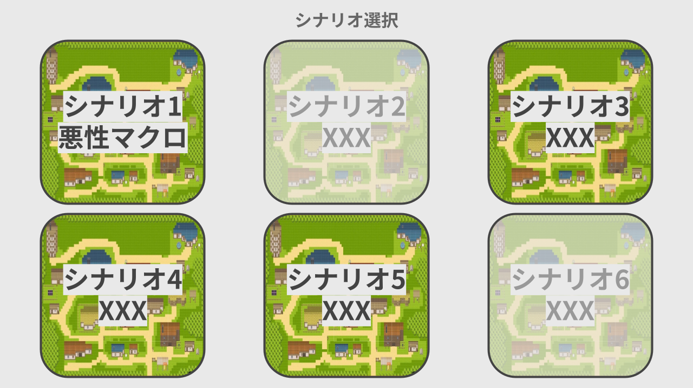

# 画面遷移・ゲームフロー

ゲームは以下の順で進行
1. タイトル・ログイン・シナリオ選択
2. 世界観の説明
3. 事件の説明
4. ミッション1: 村人に聞き込み調査をして村の怪しいことを調べよう
5. ミッション2: 呪文の痕跡を見てから村長に報告しよう
6. ミッション3: 魔法の書がしたことを調べて村長に報告しよう
7. ミッション4: 精霊がしたことを調べて村長に報告しよう
8. ミッション5: 持ち出された交易記録の数を調べて村長に報告しよう
9. ミッション6: 交易記録が流出した原因を調べて村長に報告しよう
10. ミッション7: 交易記録が送られた先を調べて村長に報告しよう
11. ミッション8: アリスに改めて話を聞こう
12. ミッション9: 「帳簿管理の魔法の書」の送り主を村長に報告しよう
13. エンディング
14. 現実のシナリオの解説

画面遷移・ゲームフローの詳細は [GameFlow.png](GameFlow.png) を参照

## 各場面の詳細

画面の番号は [GameFlow.png](GameFlow.png) 内の番号と一致している

### (1) タイトル画面
- タイトルをクリックするとログイン画面に遷移

### (2) ログイン画面
- ユーザ名とパスワードの入力欄、ログインボタンを用意
- ユーザ未登録であれば、登録画面へ遷移するためのボタンを押す
- ログインしたら、シナリオ選択画面へ遷移

画面のイメージ

### (3) 登録画面
- 基本的なつくりはログイン画面と同じ
- 登録したら自動でログインし、シナリオ選択画面へ遷移

### (4) シナリオ選択画面
- `シナリオ[通し番号]`と`簡単なシナリオ説明`を入れたボタンにする
- ボタンの背景はシナリオで使用するマップの画像とする
- セーブデータを読み込み、クリア済みシナリオは背景をグレーにしてクリア済みであることを明示する

画面イメージ

### (5) 世界観の説明画面
- 背景はマップ全体を映す
- 説明は下部のダイアログに表示
- ダイアログは`Enter` or `Space`キーで次へ進める

画面イメージ

### (6) 事件の説明画面
- 背景はマップ全体を映す
- 説明は下部のダイアログに表示
- 画面中央に説明と関連した画像を出す (例：交易記録→巻物の画像、呪文→魔法使いの画像)
- ダイアログは`Enter` or `Space`キーで次へ進める

画面イメージ

### (7) プレイヤー操作画面
- プレイヤーはマップ内を自由に移動可能
- やるべきことは画面上部に表示
- メニューボタンを押すと、メニュー画面を開ける
  - Escキーでもメニュー画面を開ける
- 左下に簡易操作説明を載せる
  - ログを見る(Lキー)
  - 情報を見る(Hキー)
  - 村人に話しかける(Eキー)

画面イメージ

### (8) メニュー画面
- 操作は「シナリオ選択に戻る」「ゲームに戻る」の2つだけ
- 画面には操作キーの一覧を表示する
  - 移動: WASD, 矢印キー
  - 会話: E
  - 会話を進める: Space, Enter
  - 選択肢の選択: 矢印キー
  - 選択肢の決定: Space，Enter
  - ログ画面を開く: L
  - ヒントを開く: H
  - メニュー画面を開く: Esc

画面イメージ

### (9) 聞いた情報の一覧表示画面
- 画面中央に大きめのダイアログを出す
- 村人の名前と村人が話した内容を表示

画面イメージ

### (10) ログ表示画面
- 検索できるようにする (`grep --color`のように含む列だけ抽出、検索文字列をハイライト)
- ログはスクロール可能にする
- ログのフォーマットは `[時間] [人名] が ([xxの呪文 or yyの魔法の書]で) [zz] をした`
- ログの行数は200行
- 検索ボックスのxボタンを押下することで検索を解除
- 時間があればブール検索を実装する

画面イメージ

### (11) 村長への報告画面
- 答えは選択式
- 正解なら、村長からの質問が続く
- 不正解なら、ヒントが与えられる

画面イメージ

### (12) ヒント画面
- 下部のダイアログで、村長がもう少しログを見ることを促す
- `Enter` or `Space`を押したら、プレイヤー操作画面2へ遷移

画面イメージ

### (13) エンディング画面
- 犯人が捕まっている画像を出す
- 下部のダイアログでは、実際のインシデントをもとにしていることを説明
- `Enter` or `Space`を押すと、解説画面に遷移

画面イメージ

### (14) 解説画面
- 現実のシナリオを説明
- シナリオと現実の対応付けは，「村長はrootユーザでした，他にも対応付けを探してみてね」くらいでとどめる
- 本編同様ダイアログで，現実のシナリオを説明 (画像はスクショまたは実際の画面のイラスト)
  1. ブラウザで，Excelファイルをダウンロードしている場面
  2. エクスプローラーでExcelファイルを開こうとしている場面
  3. 保護ビュー付きでExcelを開いた場面（「保護ビューを強調」）
  4. 保護ビューを解除する場面
  5. 保護ビューを解除した場面
- 解説画面を閉じると自動でセーブ
  - セーブは「シナリオをクリアしたか」を保存する
  - シナリオ内の進捗のセーブは非対応

画面イメージ

## 画面デザイン詳細
- 現状は上記に記載した通りで進める
- ゲームが一通り完成したらデザインをよりリッチにしていく