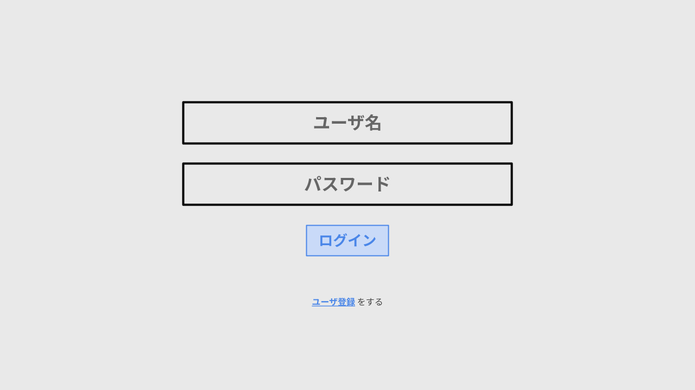

# ゲームフロー
1. タイトル
2. ログイン
3. シナリオ選択
4. 世界観の説明
5. 事件の説明
6. ミッション1: 村人に聞き込み調査をして村の怪しいことを調べよう
7. ミッション2: 呪文の痕跡を見てから村長に報告しよう
8. ミッション3: 魔法の書がしたことを調べて村長に報告しよう
9. ミッション4: 精霊がしたことを調べて村長に報告しよう
10. ミッション5: 持ち出された交易記録の数を調べて村長に報告しよう
11. ミッション6: 交易記録が流出した原因を調べて村長に報告しよう
12. ミッション7: 交易記録が送られた先を調べて村長に報告しよう
13. ミッション8: アリスに改めて話を聞こう
14. ミッション9: 「帳簿管理の魔法の書」の送り主を村長に報告しよう
15. エンディング
16. 現実のシナリオの解説

ゲームフローの詳細は [GameFlow.png](GameFlow.png) を参照

## 各場面の詳細

### タイトル
- タイトルをクリックするとログイン画面に遷移

### ログイン
- ログイン画面とユーザ登録画面が存在
  - ログイン画面
    - ユーザ名とパスワードの入力欄、ログインボタンを用意
    - ログインしたら、シナリオ選択画面へ遷移
  - ユーザ登録画面
    - ログイン画面から遷移可能
    - ユーザの登録機能は未実装
    - ユーザ名とパスワード、パスワードの確認の入力欄、登録ボタンを用意
    - 登録したら自動でログインし、シナリオ選択画面へ遷移

画面イメージ

### シナリオ選択
- `シナリオ[通し番号]`と`簡単なシナリオ説明`を入れたボタンを並べる
  - ボタンの背景はシナリオで使用するマップの画像
- クリア済みシナリオは背景をグレー
  - セーブ機能は未実装

画面イメージ

### 世界観の説明
- 背景はマップ全体
- 説明は下部のダイアログに表示
- ダイアログは`Enter` or `Space`キーで進める

画面イメージ

### 事件の説明
- プレイヤーが村長の前まで自動で移動し、村長から事件の説明を受ける
- 説明は下部のダイアログに表示
- ダイアログは`Enter` or `Space`キーで次へ進める

画面イメージ

### ミッション1
- プレイヤー操作画面ではプレイヤーは移動が可能
  - マップ内を自由に移動して村人に話を聞く
    - 対象の村人に近づいた後、Eキーで会話を開始する
- プレイヤー周辺画面ではプレイヤーは移動が不可能
- ミッション内容は画面上部に表示
- 左下に操作説明を載せる
  - 呪文の痕跡(Lキー)
  - 貰った情報(Hキー)
  - 会話の開始(Eキー)

画面イメージ

### ミッション2からミッション7
- 基本的にミッション1と同様
- プレイヤーは以下の操作によりミッションを進める
  - 呪文の痕跡を調べる
    - Lキーで呪文の痕跡画面を開く
  - 村長に話しかける
    - 村長に近づいた後、Eキーで会話を開始する
  - 貰った情報の一覧を見る
    - Hキーで貰った情報画面を開く

#### 呪文の痕跡画面
- 検索可能 (`grep --color`のように検索文字列を含む行だけ抽出、検索文字列をハイライト)
- スクロール可能
- ログのフォーマットは `[時間] [人名] は ([xxの呪文 or yyの魔法の書]で) [zz] をした`
- ログの行数は190行
- CLEARボタンを押下することで検索を解除

画面イメージ

#### 貰った情報画面
- 村人の名前と村人が話した内容を表示

画面イメージ

#### 村長からの質問
- 調査結果を村長からの質問を通して報告する
  - 答えは選択式
    - 正解なら、ミッションが進行する
    - 不正解なら、ヒントが与えられる

画面イメージ

#### ヒント
- 下部のダイアログで、ヒントを表示する

画面イメージ

### ミッション8
- 基本的にミッション1と同様
- プレイヤーはアリスに話を聞き、ミッションを進める

### ミッション9
- 基本的にミッション2からミッション7と同様
- 調査結果を村長からの質問を通して報告する

### エンディング
- 背景はマップ全体
- ナレーションは下部のダイアログに表示
- `Enter` or `Space`を押すと、解説画面に遷移

画面イメージ

### 現実のシナリオの解説
- ダイアログと画像で現実のシナリオを解説

画面イメージ

## 画面デザイン詳細
- 現状は上記に記載した通りで進める
- ゲームが一通り完成したらデザインをよりリッチにしていく